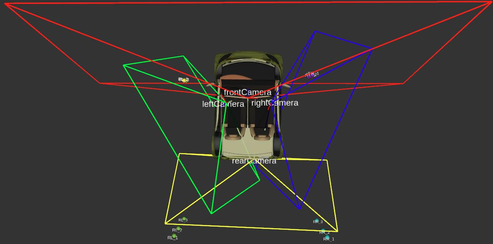
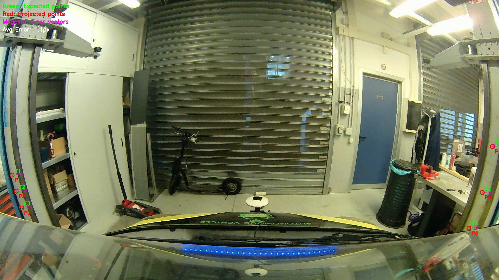
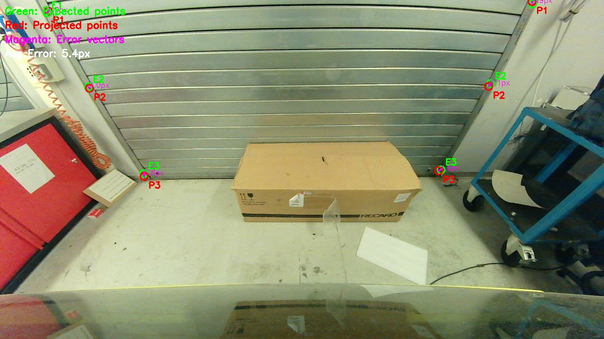
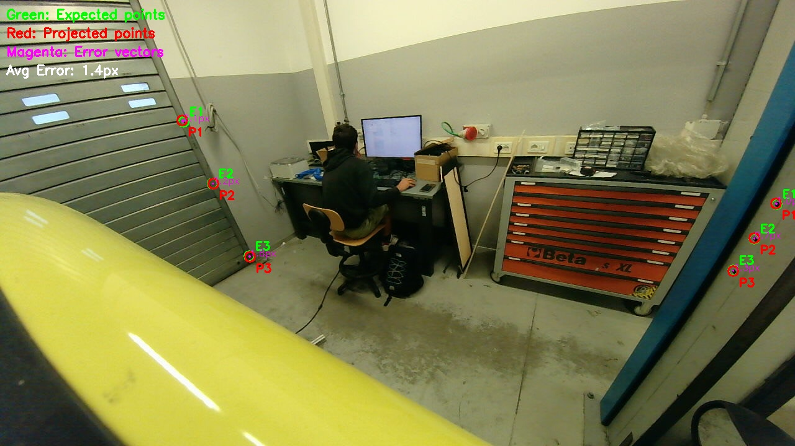
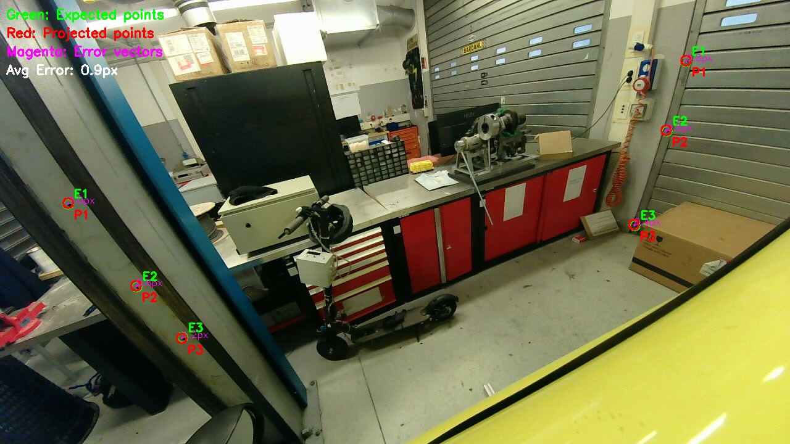

# Camera Extrinsic Calibration System

A unified, marker-free calibration system for multi-camera surround-view setups. Calibrate four fisheye cameras using simple 3D point measurements—no checkerboards, no complex setup, just measure points visible in overlapping camera fields of view.



## Why This Approach?

### ✅ **Advantages**

- **No Checkerboard Required**: Skip the hassle of printing, positioning, and maintaining checkerboard patterns
- **Flexible Measurement**: Use any clearly identifiable 3D points (corners, markers, objects) in your environment
- **Minimal Setup**: No need for a large calibration environment or precise checkerboard placement
- **Overlapping FOV Strategy**: Leverage natural overlaps between adjacent cameras for robust calibration
- **Scalable**: Add as many points as you want (minimum 3 per set) for improved accuracy
- **Visual Validation**: Comprehensive debug overlays show calibration quality at a glance

### 🎯 **How It Works**

The system uses **four point sets** corresponding to overlapping camera fields of view:

- **FL**: Points visible in both **Front** and **Left** cameras
- **FR**: Points visible in both **Front** and **Right** cameras  
- **RL**: Points visible in both **Rear** and **Left** cameras
- **RR**: Points visible in both **Rear** and **Right** cameras

Each camera is calibrated using points from **two overlapping sets**, providing robust extrinsic parameter estimation through fisheye camera model optimization.

## Quick Start

### 1. **Measure Calibration Points**

Identify and measure 3D coordinates (in vehicle frame) of points visible in overlapping camera FOVs. Minimum **3 points per set**, but more points improve accuracy.

**Coordinate System**: X-forward, Y-leftward, Z-upward (origin: rear-axle center projected on ground)

### 2. **Identify Image Points**

For each measured 3D point, identify its pixel coordinates `[u, v]` in the corresponding camera images.

### 3. **Edit Configuration**

Update `config/calibration_points.yaml` with your measurements:

```yaml
world_points:
  FL:
    - [1.39, 1.35, 1.22]  # [X, Y, Z] in meters
    - [1.39, 1.35, 1.124]
    - [1.39, 1.35, 1.020]

image_points:
  frontCamera:
    FL:
      - [47, 676]   # [u, v] in pixels
      - [63, 738]
      - [83, 801]
  leftCamera:
    FL:
      - [1250, 329]
      - [1214, 385]
      - [1180, 436]
  # ... and so on for all cameras and point sets
```

### 4. **Run Calibration**

```bash
ros2 launch surround_vision camera_calibration.launch.py
```

This will:
- Load calibration points from the config file
- Perform extrinsic calibration for all four cameras
- Save results to `config/camerasParam_extrinsic.yaml`
- Launch Rviz with visualization
- Generate debug overlay images

### 5. **Verify Results**

Check the generated debug images (`*_calibration_debug.jpg`) and Rviz visualization to validate calibration quality.

## Visualization

### Rviz/Foxglove Markers

The calibration system publishes several marker types for real-time visualization:

| Marker Type | Topic | Description |
|------------|-------|-------------|
| **Camera FOV Frustums** | `/camera_fov_markers` | Wireframe frustums showing each camera's field of view (color-coded: Red=Front, Green=Left, Blue=Right, Yellow=Rear) |
| **Calibration Points** | `/calibration_points` | Spheres and labels marking all 3D calibration points in the vehicle frame |
| **TF Transforms** | `/tf` (static) | Transformations from `vehicle` frame to each camera frame |

### Debug Overlay Images

After calibration, four debug images are generated showing reprojection errors for each camera:

<table>
<tr>
<td align="center"><strong>Front Camera</strong><br></td>
<td align="center"><strong>Rear Camera</strong><br></td>
</tr>
<tr>
<td align="center"><strong>Left Camera</strong><br></td>
<td align="center"><strong>Right Camera</strong><br></td>
</tr>
</table>

**What the overlays show:**

- 🟢 **Green circles (E)**: Expected image points from your measurements
- 🔴 **Red circles (P)**: Projected points using calibrated parameters  
- 🟣 **Magenta arrows**: Error vectors showing the difference between expected and projected points
- **Error labels**: Pixel distance between expected and projected points

**How to interpret:**

- **Small errors (< 5 pixels)**: Excellent calibration quality
- **Medium errors (5-15 pixels)**: Good calibration, acceptable for most applications
- **Large errors (> 15 pixels)**: Review point measurements and consider adding more calibration points

## File Structure

```
camera_calibration/
├── README.md                          # This file
├── unified_camera_calibration.py      # Main calibration script
├── calibrationResults.jpg             # Top-view visualization
├── front.jpg, left.jpg, right.jpg, rear.jpg  # Source camera images
└── *_calibration_debug.jpg            # Generated debug overlays
```

## Configuration Files

- **`config/calibration_points.yaml`**: Input file with 3D world points and image points
- **`config/camerasParam.yaml`**: Input file with camera intrinsic parameters
- **`config/camerasParam_extrinsic.yaml`**: Output file with calibrated extrinsic parameters

## Tips for Best Results

1. **Point Selection**: Choose points that are:
   - Clearly visible in both overlapping cameras
   - Well-distributed across the overlapping FOV region
   - At varying distances from the vehicle
   - Easy to identify precisely in images

2. **Measurement Accuracy**: 
   - Use precise measurement tools (laser rangefinder, tape measure, etc.)
   - Measure in the vehicle coordinate system (X-forward, Y-leftward, Z-upward)

3. **Image Point Identification**:
   - Use image annotation tools or click directly on images
   - Ensure pixel coordinates are accurate (sub-pixel precision helps)

4. **More Points = Better Accuracy**:
   - While 3 points per set is the minimum, 5-10 points per set typically yields better results
   - Distribute points across different depths and angles

## Troubleshooting

**Calibration fails:**
- Verify all point sets have at least 3 points
- Check that image points match world points (same order)
- Ensure points are within image bounds

**Large reprojection errors:**
- Review measurement accuracy
- Add more calibration points
- Verify image point coordinates are correct

**Points not visible in Rviz:**
- Check that `/calibration_points` topic is subscribed in Rviz
- Verify fixed frame is set to `vehicle`
- Ensure markers are enabled in the display panel

## Technical Details

- **Camera Model**: Fisheye (OpenCV `cv2.fisheye.solvePnP`)
- **Optimization**: Iterative PnP solver
- **Coordinate Frames**: Vehicle frame (X-forward, Y-leftward, Z-upward) to Camera frames
- **Output Format**: 4×4 homogeneous transformation matrices (row-major)

---

**Need help?** Check the main [README.md](../README.md) or open an issue on GitHub.

